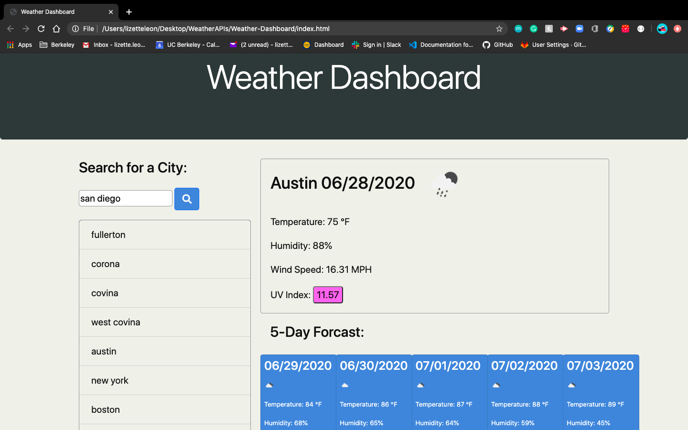

# Weather-Dashboard

<!DOCTYPE html>

<html lang="en-us">
    <head>
        <meta charset="UTF-8" />
    </head>
    <header>
        <h2>
            Description
        </h2>
            

                In this project I have created a weather dashboard. When the user enters the name of the city into the search box, the forecast for the day and the next five days appears. The forecast displays the city name, the date, an icon representation of weather conditions, the temperature, the humidity, the wind speed, and the UV index. The UV index changes color depending on the level of UV that ranges from favorable, moderate and severe. The five daye forecast also includes the date an icon that changes depending on weather conditions, temperature and the current humidity. The search history is stored using local starage and remians listed on the page. 
            

        <h2>
            Technologies Used:
        </h2>   
            

                HTML, CSS, Javascript, APIS
            

    <header>
    <section>
      
    </section>
    <section>
        

            The URL of the deployed application
            <a href="https://lizetteleon14.github.io/Weather-Dashboard/">The URL of the deployed application</a>
        

    </section>
    <section>
        

            The URL of the GitHub repository 
            <a href="https://github.com/lizetteleon14/Weather-Dashboard">The URL of the Git</a>
        

    </section>
    
